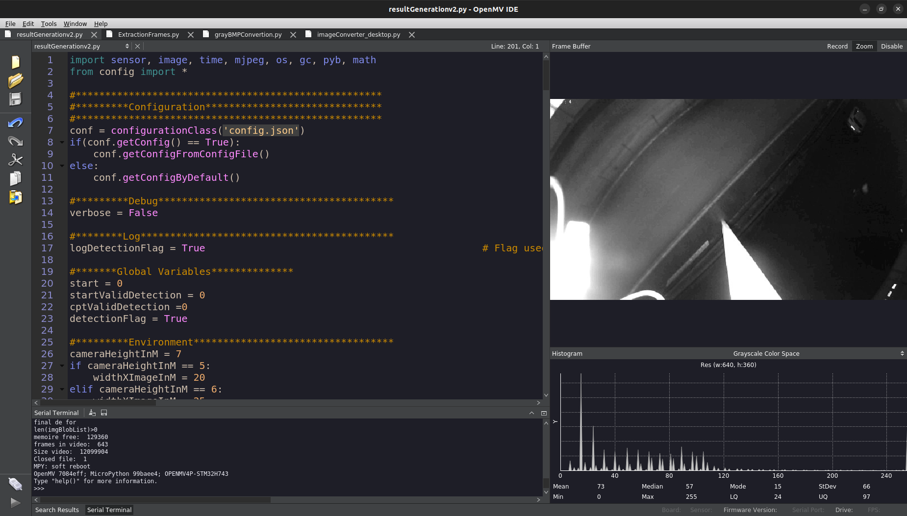

# Flux video in H7 plus

  

## Table Of Content

- [Description](#description)

- [Installation](#installation)
- [Usage](#usage)
- [Contributing](#contribution)
- [Tests](#tests)
- [GitHub](#github)
- [Contact](#contact)
- [License](#license)

  

## Description

  This project aims to integrate the video stream into the H7 plus board so that it will be more effective to launch image processing tasks in an on-board way without the need to deploy a test on the road. The mode of operation for the moment is to extract frames from an original video, reconvert these frames to the ideal format and then load them consecutively to be processed in pairs, finally generating an output video with each pair of processed frames. In this way it is possible to simulate the behavior of Strigoo as if it were being used live. 

This application is divided into different micropython scripts that will be executed on the board and others that must be executed in desktop python to convert the images, because the treatment to transform the images to a suitable format must be accurate.

   
Flux video in OpenMV IDE

## Installation

To install and use the injection of flux video:

1. Clone the gitHub repository: 

	git clone :::

2. Take a video in format .mjpeg

3. You must install OpenMV IDE and ensure that /ffmpeg is installed for that go to:

	 <openmvide_installdir>/share/qtcreator/ffmpeg

4. Move all scripts and video .avi converted to SD card into board H7 plus

That's all you need in Usage section you will read how to use it 

Flux video in H7 plus is built with the following tools and libraries: <ul><li>Python</li><li>os</li><li>glob</li><li>PIL</li><li>micropython(OpenMV IDE)</li><li>sensor</li><li>image</li><li>time</li><li>AVIParse</li><li>mjpeg</li><li>time</li></ul>

## Usage
 
Here are step-by-step instructions for using the flux video in H7+ board:

1. You must change the extension from ".mjpeg" to ".mp4"
	- Right click choose rename
	- Change ".mjpeg" to ".mp4"
	- Exemple: video.mjpeg -> video.mp4
2. Now you should convert video from ".mp4" to ".avi", to do that:
	- Go to folder where ffmpeg is placed. Commonly is in <openmvide_installdir>/share/qtcreator/ffmpeg
	- Use the next command:
	 ./ffmpeg -i input.mp4 -vcodec mjpeg -vf "scale=640:-1"  -q:v 2 -an video.avi
	-  Where "input.mp4" is the name of the input video, and "video.avi" is the name of output video, this will be the video to use.
3. Now you must use the file "ExtractionFrames.py" and execute it in the OpenMV IDE connected to H7+ board, change the filename parameter in the script to operate the video. You will see a folder named "frames_analyse" where are all the frames.
4. In order to convert the ".jpg" images to ".bmp" images you must execute the script named "imageConverter_desktop.py" through desktop python to do that:
	- Open SD folder from the board
	- Do right-click and select open terminal
	- type: python3 imageconverter_desktop.py
4. (Optional) To reduce size files and processing time is recommendable to change the traditional .bmp format to "openmv" .bmp format to do that execute the file "grayBMPConvertion.py" in Openmv IDE
Here you have all the images in the format to simulate one scenario.
5. In this repository you have an exemple like Strigoo were used, if you execute "resulGenerationv2.py" you will see a video named "Result2.mjpeg" where all the frames processed are stored. 

## Contribution
 
This projet was made for Keyia SAS. You must communicate with them to do a contribution.

## Tests
 
After use this repository you will see one video that simulates the Strigoo behavior. You should be capable of see it in your machine.

## GitHub

<a href="https://github.com/edgarnica"><strong>edgarnica</a></strong>

## Contact

Feel free to reach out to me on my email:
eduardo.garnica@keyia.fr

## License

